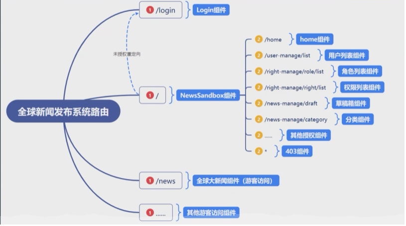
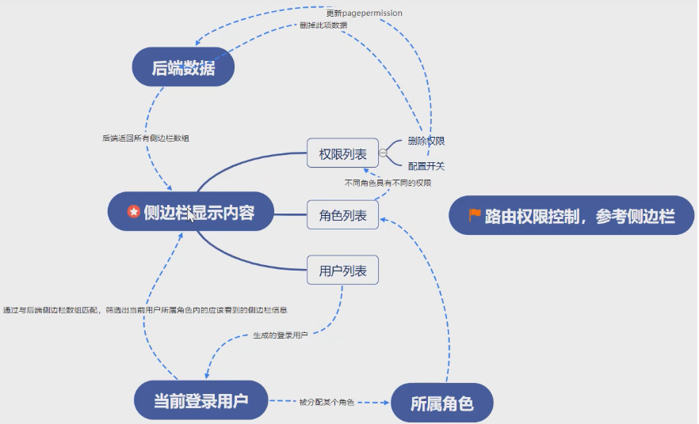

# newsEveryone

 news manage system to make everyone can view,write and publish  news!

 部署指南
 ```shell
 cd db
 #启动接口服务
 json-server --watch db.json --port 8000 
 cd ..
 npm start
```

### 业务流程
  * 审核流程 auditState [未审核,正在审核,已通过,未通过]
  * 发布流程 publishState [未发布,待发布(审核通过),已发布,已下线]
### 特点
* 路由和权限挂钩 不能通过路由渗透没有权限的页面(路由校验)
  * 动态创建路由(根据pagePermisson和用户具有的权限列表进行动态创建)
* redux集中管理某些状态(isCollapsed and isLoading)
  * redux状态保存在内存中，刷新之后状态就会变为初始状态，因此需要对某些状态持久化(redux-persist,比如isCollapsed状态)
### 系统路由

### 权限控制
